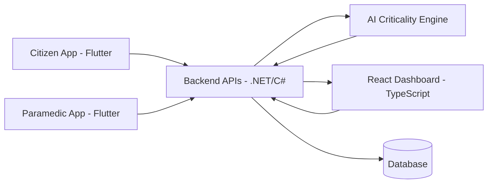

<div align="center">

  
### *RESCUFY*

### *AI-Powered Emergency Intelligence & Response Platform*

<p>
  
  
  
  
</p>

<p align="center">
  <a href="#-vision">
    
  </a>
  <a href="#-what-makes-rescufy-special">
    
  </a>
  <a href="#-platform-modules">
    
  </a>
  <a href="#-ai-criticality-engine">
    
  </a>
  <a href="#-react-control-center">
    
  </a>
  <a href="#-architecture">
    
  </a>
  <a href="#-quick-start">
    
  </a>
</p>

</div>

---

## 🎯 Vision

**Rescufy** is a graduation project designed to modernize emergency-response operations through intelligent prioritization and real-time coordination.

It combines:

- **AI-based emergency request analysis**
- **React-powered operational dashboard**
- **Robust .NET backend services**
- **Dual Flutter mobile applications**

Our mission is to ensure emergency teams act faster and smarter by identifying critical cases as early as possible.

---

## 🔥 What Makes Rescufy Special

<table>
  <tr>
    <td width="50%">
      <h3>🧠 AI Criticality Classification</h3>
      <p>
        Incoming requests are analyzed by an AI engine that estimates urgency level (Critical / High / Normal),
        helping responders prioritize high-risk incidents first.
      </p>
    </td>
    <td width="50%">
      <h3>⚡ Priority-Driven Dispatch Workflow</h3>
      <p>
        Rescufy supports urgency-based response logic instead of simple queue ordering,
        reducing delay for life-threatening situations.
      </p>
    </td>
  </tr>
  <tr>
    <td width="50%">
      <h3>⚛️ React Control Center</h3>
      <p>
        The web frontend is built with <b>React + TypeScript</b>, giving dispatch teams a clear and modern
        interface for monitoring requests, priorities, and responder status in real time.
      </p>
    </td>
    <td width="50%">
      <h3>📱 Role-Based Mobile Experience</h3>
      <p>
        Two dedicated Flutter apps: one for citizens submitting emergency requests,
        and one for paramedics receiving prioritized assignments and updates.
      </p>
    </td>
  </tr>
</table>

---

## 🧩 Platform Modules

<table>
  <tr>
    <th align="left">Module</th>
    <th align="left">Path</th>
    <th align="left">Purpose</th>
  </tr>
  <tr>
    <td><b>AI Engine</b></td>
    <td><code>/ai</code></td>
    <td>Analyzes request context and classifies severity level.</td>
  </tr>
  <tr>
    <td><b>Backend Services</b></td>
    <td><code>/backend</code>, <code>/RescufyBackendNew</code></td>
    <td>APIs, business logic, incident lifecycle, and data operations.</td>
  </tr>
  <tr>
    <td><b>Web Frontend</b></td>
    <td><code>/frontend</code></td>
    <td>React dashboard for dispatchers and operational monitoring.</td>
  </tr>
  <tr>
    <td><b>User Mobile App</b></td>
    <td><code>/mobile/rescufy</code></td>
    <td>Emergency request submission and status tracking.</td>
  </tr>
  <tr>
    <td><b>Paramedic App</b></td>
    <td><code>/mobile/rescufy_paramedic</code></td>
    <td>Incident alerts, assignment handling, and response updates.</td>
  </tr>
</table>

---

## 🤖 AI Criticality Engine

### Processing Flow

```text
Emergency Request Received
        ↓
Context & Signal Extraction
        ↓
AI Severity Prediction
        ↓
Priority Assignment
        ↓
Dispatcher & Paramedic Notification
        ↓
Case Tracking Until Resolution
```

### Practical Impact

- Faster recognition of high-risk emergencies  
- Better paramedic/resource allocation  
- Reduced dispatcher overload  
- Improved consistency in triage decisions  

---

## ⚛️ React Control Center

The React frontend acts as the live command layer of Rescufy.

### Key capabilities

- Real-time incident feed  
- AI severity indicators per case  
- Case status and timeline tracking  
- Filtering by urgency/status/time  
- Fast assignment support for dispatchers  

### Design priorities

- **Clarity:** critical information first  
- **Speed:** minimal-click workflow  
- **Scalability:** maintainable component architecture  
- **Reliability:** predictable and responsive UI state  

---

## 🏛️ Architecture



---

## 🧰 Technology Stack

<p>
  
  
  
  
  
  
</p>

---

## 🚀 Quick Start

> Update commands if your current scripts/entry points differ.

### 1) Run Backend
```bash
cd RescufyBackendNew
dotnet restore
dotnet run
```

### 2) Run AI Service
```bash
cd ai
# install dependencies
# run AI entry point
```

### 3) Run React Frontend
```bash
cd frontend
npm install
npm run dev
```

### 4) Run Mobile Apps
```bash
# User App
cd mobile/rescufy
flutter pub get
flutter run

# Paramedic App
cd mobile/rescufy_paramedic
flutter pub get
flutter run
```

---

## 🧪 Demo Scenario (Presentation-Friendly)

1. Citizen submits emergency request  
2. AI analyzes request and predicts severity  
3. Case appears in React dashboard with urgency indicator  
4. Dispatcher assigns nearest available paramedic  
5. Paramedic receives prioritized alert in mobile app  
6. Response progress is tracked until case closure  

---

## 🎓 Graduation Project Value

Rescufy demonstrates:

- Applied AI in a high-impact real-world domain  
- Full-stack engineering across web, backend, and mobile  
- Real-time operational system design  
- Human-centered emergency workflow optimization  

---

## 👥 Team

<table>
  <tr>
    <th align="left">Name</th>
    <th align="left">Role</th>
  </tr>
  <tr>
    <td>Your Name</td>
    <td>Project Lead / Full-Stack Development</td>
  </tr>
  <tr>
    <td>Member 2</td>
    <td>AI Engineering</td>
  </tr>
  <tr>
    <td>Member 3</td>
    <td>Mobile Development</td>
  </tr>
  <tr>
    <td>Member 4</td>
    <td>React Frontend & UX</td>
  </tr>
</table>

**Supervisor:** Dr./Eng. [Name]  
**Institution:** [University Name]

---

<div align="center">
  
  <p><i>Built to prioritize urgency. Built to protect lives.</i></p>
</div>
